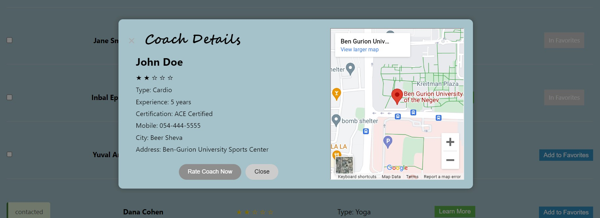
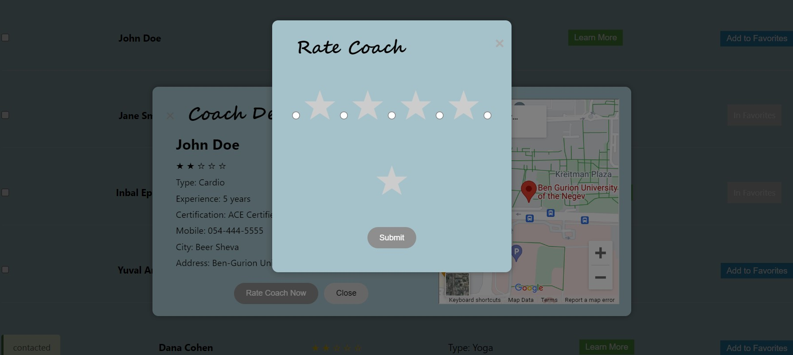
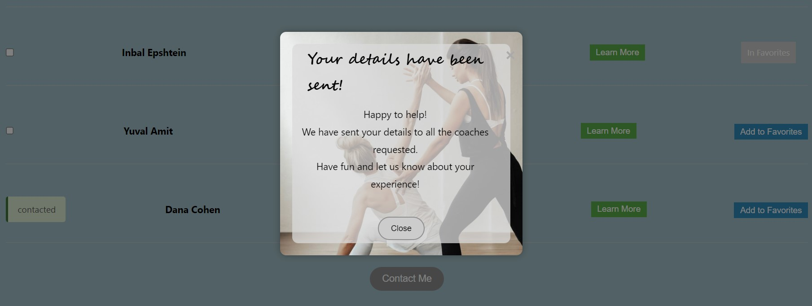

# WEB course 2024 Part C
Group 7 - Shiraz Bronstein, Ido Dwek

## Find Coach Web Application
## Project Overview

This web application is designed to help users search for fitness trainers in their city or nearby their current location. The application provides an easy and user-friendly platform to connect fitness enthusiasts with professional trainers.

## User Guide

### Visiting the Home Page

1. Enter the website's URL to navigate to the home page.
2. On the home page, you can read about the general details of the service offered.

### Signing Up

3. Click on the 'Sign Up' button to register as a new user.
4. Fill out the registration form with your personal details.
5. Submit the form to create your new account.

### Logging In

6. If you are an existing user, click the 'Sign In' button.
7. Enter your login credentials (username and password).
8. Click on 'Sign In' to access your account.

### Searching for Coaches

9. Once logged in, navigate to the 'Find Coach' page via the navigation bar.
10. Use the search filters to find coaches that fit your preferences.
11. View the list of coaches that match your search criteria.

### Viewing and Rating Coaches

12. Click on any coach's "Learn More" button to view more details.
13. You can rate the coach based on your experience by clicking on the "Rate Coach Now" button.

### Adding Coaches to Favorites

14. To add a coach to your favorites, click the 'Add to Favorites' button on their row.
15. To view your list of favorite coaches, go to the 'Favorites' section via the navigation bar.

### Deleting Coaches from Favorites

16. To delete a coach from your favorites, click the 'Delete' button on their row.

### Updating Personal Details

17. To update your personal details, navigate to 'My Account' via the navigation bar.
18. You can edit your details here (note that the email address cannot be changed as it's your user ID).

### Logging Out

19. To log out of your account, click the 'Logout' button found in the navigation bar.
20. You will be redirected back to the home page.

### Features
#### (More screenshots can be seen in the 'readme_screenshots' directory)

- **Home Page**: General details about the service with options to sign in or sign up.

- **Sign-Up Page**: For new users to sign up.

- **Sign-In Page**: For existing users to sign in.

- **Coach Search Page (findCoach)**: Registered users can:
  - Search for coaches based on preferences.
  - View specific details of each coach (learn-more button) - code is in the coachDetails directory.
  - Rate coaches - through the learn-more button  - code is in the rateForm directory.
  - Add coaches to their favorite list.
  - Select coaches and send a "Contact Me" request - adds the user's phone number to the intrested-list of each coach.

- **coach details**: Users can view coach details via "learn more" button

- **coach rating**: Users can rate coach  via "rate coach now" button

- **"Contact Me" request**: Users can send their details to specific coaches

- **Confirmation message**: After sending their details to specific coaches, the user receives confirmation message. He is not able to select that coach for contacting again.

- **Favorites Page**: Users can manage their favorite coaches, view coaches details, rate coaches, and remove coaches from the list.

- **User Profile Page**: Users can view and update their personal details (excluding the email which is a permanent identifier).

- **About Us Page**: Information about the creators and purpose of the application.

- **Logout Feature**: Allows users to disconnect and return to the home page.

