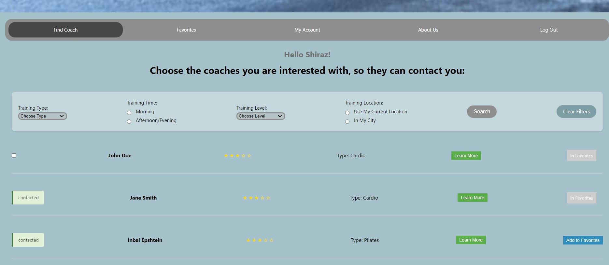
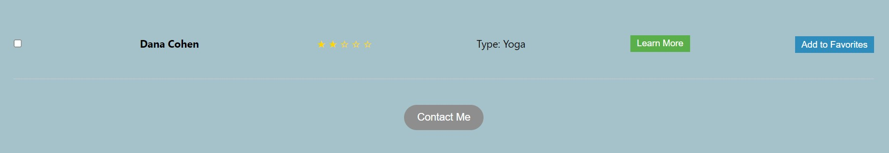
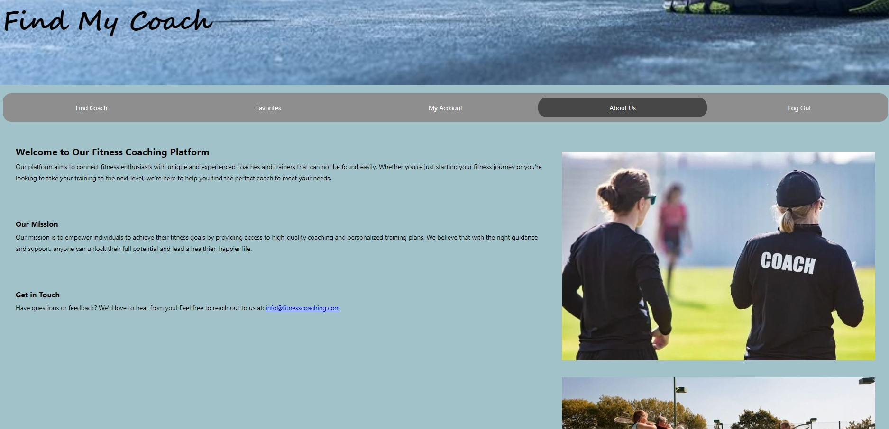

# WEB course 2024 Part C
Group 7 - Shiraz Bronstein, Ido Dwek

## Find Coach Web Application
## Project Overview

This web application is designed to help users search for fitness trainers in their city or nearby their current location. The application provides an easy and user-friendly platform to connect fitness enthusiasts with professional trainers.

### Features
#### (More screenshots can be seen in the 'readme_screenshots' directory)

- **Home Page**: General details about the service with options to sign in or sign up.

- **Sign-Up Page**: For new users to sign up.

- **Sign-In Page**: For existing users to sign in.

- **Coach Search Page (findCoach)**: Registered users can:
  - Search for coaches based on preferences.
  - View specific details of each coach (learn-more button) - code is in the coachDetails directory.
  - Rate coaches - through the learn-more button  - code is in the rateForm directory.
  - Add coaches to their favorite list.
  - Select coaches and send a "Contact Me" request - adds the user's phone number to the intrested-list of each coach.

- **coach details**: Users can view coach details via "learn more" button

- **coach rating**: Users can rate coach  via "rate coach now" button

- **"Contact Me" request**: Users can send their details to specific coaches

- **Confirmation message**: After sending their details to specific coaches, the user receives confirmation message. He is not able to select that coach for contacting again.

- **Favorites Page**: Users can manage their favorite coaches, view coaches details, rate coaches, and remove coaches from the list.

- **User Profile Page**: Users can view and update their personal details (excluding the email which is a permanent identifier).

- **About Us Page**: Information about the creators and purpose of the application.

- **Logout Feature**: Allows users to disconnect and return to the home page.

